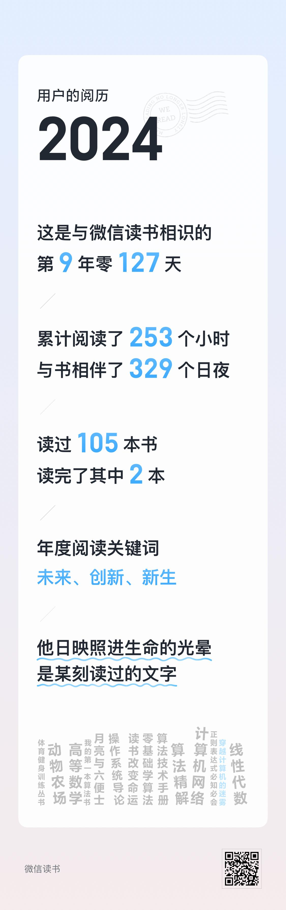
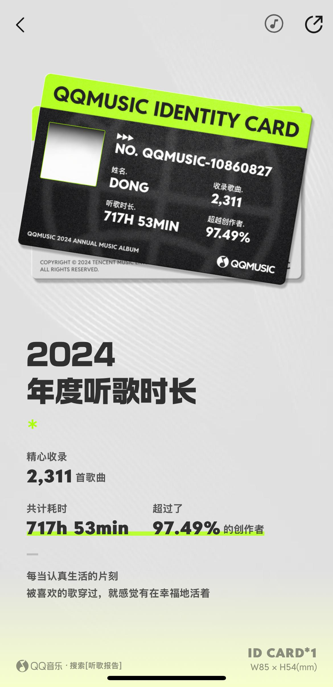

# 2014 年生活小记

年底了，小记一下

最近的作息有些紊乱。每天晚上八九点就困得不行，早早入睡后，至凌晨一两点却又醒了，再睡又睡不着。然而，到白天又困得不行，午休一小时，都不足以解困，实属有点难搞，

## 工作

自 13 年底起，公司陆续展开裁员行动。当下，每日都需进行各类工时的统计、日报的填写，以及对电脑使用时长的监控。近期，还存在一定程度的软性加班情况。我所在的公司亦在进行降绩效、调整工资等操作，这着实令人不爽。尽管内心对此颇为抵触，但暂时无力改变这一现状。现在每天上班，就盼着下班，按时溜溜球。

## 编程

编程是我的工作，也是我的选择。平心而论，我乐于从事这份工作，沉浸于代码世界中，享受凭借逻辑和思路解决问题的过程。即便有时基础知识有所欠缺，无法完全满足需求，我也会竭尽全力去实现相应功能。当问题最终得以解决时，我深感满足。我认为自己是一个注重实际的实用主义者。

## 锻炼

今年总共去锻炼了 16 次，上半年去的次数稍多一点，有 15 次，下半年就去了 1 次，次数相比 2013 年的最后三个月还少。期望在新的一年里会多一些锻炼，让自己变得更加强壮。锻炼的确能够提升自信心，“我现在无所不能了”！

我感到特别幸运能够遇到我的陈教练。他给人的感觉是充满信心，干脆果断，说话又好听；与他交流时，能感受到他独特的魅力，他也乐于分享的高光时刻的喜悦。我去锻炼得少，一方面是由于我自己时间不充裕，另一方面是教练有时也没空。我也曾思考过更换教练，一方面是自己较为懒惰且社恐，不想再去结识新的教练，而且我的要求也别太高，毕竟这么多没教练不也过来么，最为重要的是，我认为他是真诚的， 值得成为朋友

## 成长

前几年，是我极度缺乏自信的时期，很多时候我只想默默待在一旁。如今，虽然仍会存在一些顾虑，偶尔也患得患失，但已经有很多变化。我愿意表达自己的观点，在应当发言时，也能够理直气壮地进行表达。

我也发现了，保持一定程度的“高冷”反而更好。摒弃杂念，排除外界干扰，专注于做好自己才是正确的道路。想得多，顾虑多、而行动少，反而导致顾此失彼，事事都难以把握。

期望自己能够成为一个由内而外散发独特气质的人——优雅、自信且从容。

## 未来

心怀感恩，做自己！攒钱，攒钱，攒钱，努力学习，强壮身体。

## APP年度总结

微信阅读年度报告

QQ 音乐年度

