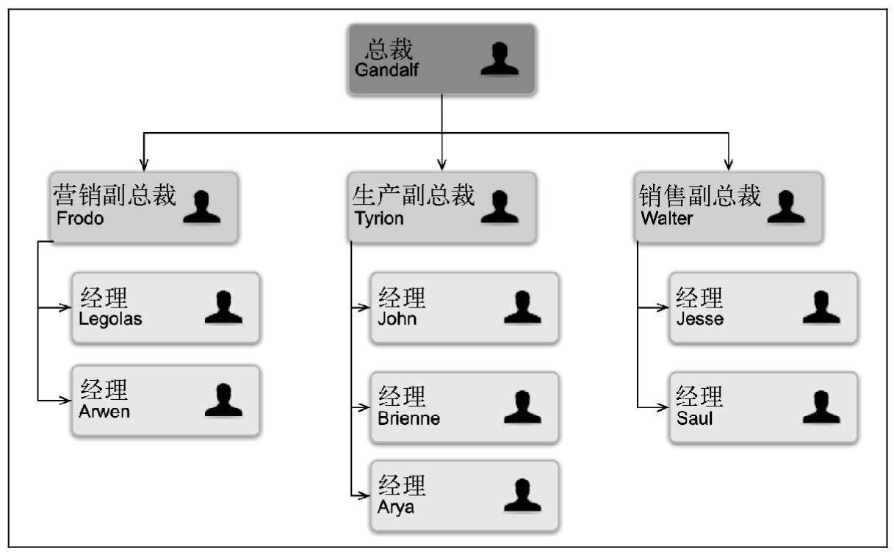

# JavaScript 数据结构 —— 树

树是一种分层数据结构的抽象模型。常见的例子是家谱，或公司的组织架构图。



树相关的术语

- 根节点
- 子树
- 树的高度
- 树的深度

## 二叉搜索树

二叉树：节点只能有两个子节点。一个时左侧子节点，另一个时右侧子节点。

二叉搜索树（BST）： 二叉树的一种，左节点小于父节点，右侧节点大于父节点。

BST各节点之间的排列形式总是如下

```txt
 中
小 大
```

二叉树搜索树数据结构的组织方式


二叉搜索树的方法

- `insert(key)` 在树中插入一个新的键
- `search(key)` 在查找节点
- `preOrderTraverse()` 先序遍历所有节点
- `inOrderTraverse()` 中序遍历所有节点
- `postOrderTraverse()` 后序遍历所有节点
- `min()` 返回树中最小的值/键
- `max()` 返回树中最大的值/键
- `remove(key)` 返回树中最小的值/键

## 树的遍历

- 先序遍历: 根左右
- 中序遍历: 根左右
- 后序遍历: 根左右

最小值：树的最后一层最左侧的节点

最大值：树的最后一层最右侧的节点

因此寻找最小值，总是沿着树的左边寻找；寻找最大值，总是沿着树的右边寻找

### 删除节点

#### 移除叶子节点

> 移除 `6` 即可


#### 移除只有左侧子节点或只有右侧子节点的节点

> 移除 `5` ，把 `7` 的子节点修改为 `3`


#### 移除存在两个子节点的节点

> 移除 `15`，找到 `15` 节点的右子树最小的节点(即右子树左下角的节点) `18` 填充 `15` 的位置，并删除原有的 `18`


### 代码实现

[二叉搜索树](https://gist.github.com/qwasfun/d447503919eb27cc9ec55a0ddf57f016)

## 自平衡树

自平衡树 AVL 在添加或移除节点时，会尝试保持自平衡，使任何一个节点左右两侧子树的高度之差为 1 。

平衡操作 —— AVL 旋转

左-左 (LL) 向左的单旋转
右-右 (RR) 向右的单旋转
左-右 (LR) 向右的双旋转（先LL旋转，再RR旋转）
右-左 (RL) 向左的双旋转（先RR旋转，再LL旋转）

## 红黑树
