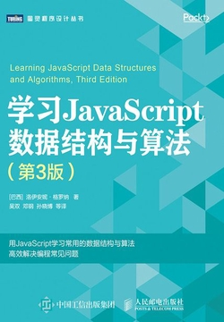
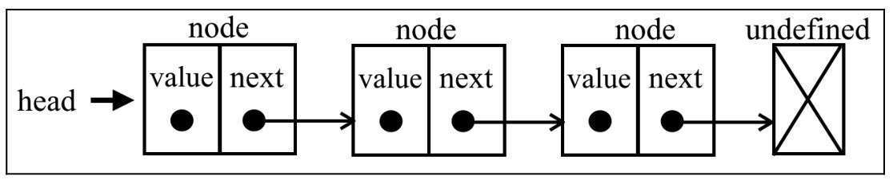
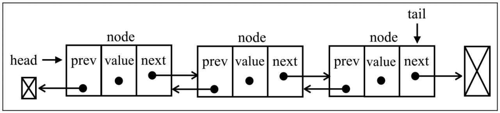
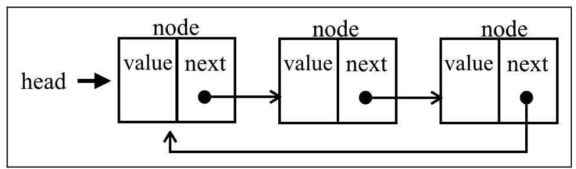

# JavaScript 数据结构

内容来自《[学习JavaScript数据结构与算法（第3版）](https://weread.qq.com/book-detail?v=99732570718ff67e997e35b)》 洛伊安妮·格罗纳



## 栈

遵循后进先出 (LIFO) 原则的有序的集合

### 基于数组实现

https://gist.github.com/qwasfun/670a118ffca4b1807a1b19b41b0e7c20

### 基于对象实现

创建一个栈

```js
class Stack {
  constructor() {
    this.items = {}
  }
}
```

栈的方法

- `push()` 添加一个（或多个）新元素到栈顶

- `pop()` 移除栈顶的元素，同时返回被移除的元素

- `peek()` 返回栈顶的元素，不对栈做修改

- `isEmpty()` 判断栈里是否为空

- `size()` 返回栈里的元素个数

- `clear()` 移除栈里的所有元素

- `toString()`

https://gist.github.com/qwasfun/403507aa3ed95d3b58e305377b79887f

### 栈的应用

进制的转换

## 队列

遵循先进先出 (FIFO) 原则的一组有序的集合

创建一个队列

```js
class Queue {
  constructor() {
    this.count = 0
    this.lowestCount = 0
    this.items = {}
  }
}
```

队列的方法

- `enqueue(item)` 向队列尾部添加一个（或多个）新的项

- `dequeue()` 移除队列的第一项，并返回被移除的元素

- `peek()` 查看队列头元素

- `isEmpty()` 判断队列中是否为空

- `size()` 返回队列包含元素的个数

- `clear()` 清空队列

- `toString()`

https://gist.github.com/qwasfun/d8041adb9a94dfe41c76d038857310e0

## 双端队列

双端队列（dque 或 double-ended queue）一种允许同时从前端和后端添加和移除元素的特殊队列，同时遵守先进先出和后进先出原则

常见应用 存储一系列撤销操作

创建一个双端队列

```js
class Deque {
  constructor() {
    this.head = 0
    this.tail = 0
    this.items = {}
  }
}
```

队列的方法

- `addFront(item)` 在队列前端添加新的元素

- `addBack(item)` 在队列后端添加新的元素（和 Queue 中 enqueue 方法相同）

- `removeFront()` 在队列前端移除第一个元素（和 Queue 中 dequeue 方法相同）

- `removeBack()` 在队列后端移除一个元素（和 Stack 中 pop 方法相同）

- `peekFront()` 返回队列前端第一个元素（和 Queue 中 peek 方法相同）

- `peekBack()` 返回列后端第一个元素（和 Stack 中 peek 方法相同）

- `isEmpty()` 判断队列是否为空

- `clear()` 清空队列

- `size()` 返回队列长度

- `toString()` 将队列转换成为字符串

https://gist.github.com/qwasfun/ef71129272da894060b519547d68e20c

### 应用

循环队列击鼓传花游戏

## 链表

LinkList

链表存储有序的元素集合，但不同于数组，链表中的元素在内存不是连续放置。

每个元素由一个存储元素本身的节点和一个指向下一个元素的引用（也称指针或链接）组成。



相较于数组，链表添加或移除元素的时候不需要移动其他元素。在访问元素时，在数组中，我们可以直接访问任何位置的任何元素，访问链表中元素，需要从起点（表头）开始迭代链表直到找到所需的元素。

- `push(element)` 向链表尾部添加一个新元素

- `insert(element,position)` 向链表的的特定位置插入一个新元素

- `getElementAt(index)` 返回链表中特定位置的元素。如果不存在，返回 `undefined`

- `remove(element)` 从链表中删除一个元素

- `indexOf(element)` 返回元素在链表中的索引。如果链表中没有该元素返回 `-1`

- `removeAt(position)` 从链表的特定位置移除一个元素

- `isEmpty()` 如果链表不包含任何元素，返回 `true`，如果链表长度大于 0 则返回 `false`

- `size()` 返回链表包含的元素格式，与数组的 length 属性类似

- `toString()` 返回表示整个链表的字符。由于列表项使用了 Node 类，需要重写继承
  自 Javascript 对象默认的 toString() 方法。让其只输出元素的值。

https://gist.github.com/qwasfun/1824034241198de719fd3586e90ef934

### 双向链表

DoubleLinkList

在链表中一个节点只有链向下一个节点的链接；而在双向链表中，链接是双向的：一个链向下一个元素，另一个链向上一个元素



https://gist.github.com/qwasfun/174b428587ba241c4724f2c63ccf10bf

### 循环链表

CircularLinkedList

循环链表与链表之间的区别在于，最后一个元素的指针 `tail.next` 不是引用 `undefined` 而是指向第一个元素 `head`



双向循环列表中有指向 head 元素的 tail.next 和指向 tail 元素的 head.prev

### 有序列表

SortedLinkList

有序列表是指保持元素有序的链表结构

https://gist.github.com/qwasfun/3e2d4e08b56b4dc6776cd0612e926a7b

### 栈链表

StackLinkList

使用双向链表 `DoubleLinkList` 保存数据，因为对于栈来说，需要向链表的尾部添加元素，也需要从链表尾部删除元素。

https://gist.github.com/qwasfun/9e440e9be4aeddb2a568e485e3ed1738

## 字典

创建字典类

```js
function defaultToString(item) {
  if (item === null) {
    return 'NULL'
  }
  if (item === undefined) {
    return undefined
  }
  if (typeof item === 'string' || item instanceof String) {
    return `${item}`
  }
  return item.toString()
}

class Dictionary {
  constructor(toStrFn = defaultToString) {
    this.toStrFn = toStrFn
    this.table = {}
  }
}
```

字典的方法

- `set(key,value) `向字典添加新元素，如果key已经存在，那么更新对应的的value

- `remove(key)` 移除字典中键对应的数据

- `hasKey(key)` 判断字典中是否存在某个键

- `get(key) `通过键查找特定的值并返回

- `clear() `删除字典中所有的值

- `size() `返回字典中包含值得数量

- `isEmpty()` 当size() 等于零的时候为true 否则返回false

- `keys()` 将字典所包含的所有键名以数组形式返回

- `values() `将字典包含的所有数据值以数组形式返回

- `keyValues()` 将字典中所有的[键, 值] 对返回

- `forEach(callbackFn)` 迭代字典中所有的键盘对

[字典](https://gist.github.com/qwasfun/ec06711635eca53cdb36db5475611213)

## 散列表

散列表是字典的一种实现。

散列算法的作用是尽可能快地在数据结构中找到一个值。

散列函数的作用是给定一个键值，然后返回值在表中的地址。

最常见的 lose lose 散列函数

散列表的方法

- `put(key,value)` 向散列表添加一个新的项（也可以更新散列表）

- `remove(key)` 根据键从散列表移除值

- `get(key) `返回根据键检索到的特定的值

[hash表](https://gist.github.com/qwasfun/f24b933b225f810134ec1e872fbe156e)

### 处理散列表中的冲突

一些键会有相同的散列值，不同的值在散列表中对应相同位置的时候，称为冲突。处理冲突的方法有：分离链接、线性探测和双散列法

书中介绍了分离链接、线性探测方法，这两种方法都需要重写类的方法 put remove get

1. 分离链接法： 为散列表的每一个位置创建一个链表并将元素存储在里面。解决方法最简单的方法，但是在 HashTable 实例外还需要额外的存储空间

   [分离链接处理 散列表冲突](https://gist.github.com/qwasfun/5c56fd07555b092bd8849b06cbb8c722)

2. 线性探查： 处理冲突的方法是将元素直接存储在表中，而不是单独的数据结构中。当向表中某个位置添加新元素的时候，如果索引为position的位置已经被占据了，就尝试position+1的位置，如果position+1的位置也被占据了就尝试position+2的位置，以此类推，直到找到一个空闲的位置。

   线性探查分为两种：
   - 一种使用软删除，使用一个特殊的值（标记）来标记键值对被删除了（惰性删除或软删除）
   - 另一种方法需要检验是否有必要将一个或多个元素移动到之前的位置
   - [散列表 线性探查 移动元素处理冲突](https://gist.github.com/qwasfun/3477b022a1213bbe85062f15bb9c0d02)
