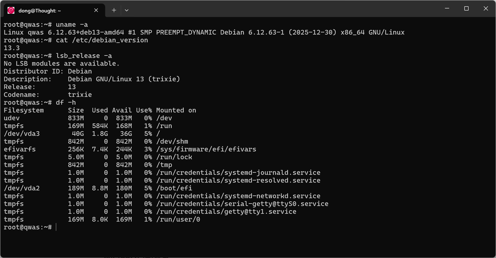

# Debian 使用

都说 Debian 好，从今天开始使用 Debian 吧

## 查看版本信息

```bash
uname -a
```

```sh
cat /etc/debian_version
```

```sh
lsb_release -a
```

```bash
df -h
```



使用的是最新版 debian 13.3，阿里云里预装的 Debian 系统真小，只占用 1.8GB 的磁盘。

## 配置SSH自动登录

生成 SSH 密钥对

```bash
ssh-keygen -t ed25519 -C "用户名@备注信息-日期"
```

> 引号中内容为备注信息，可以任意填写
>
> 默认保存路径 `~/.ssh/` , `~/.ssh/id_ed25519` 为私钥, `~/.ssh/id_ed25519.pub` 为公钥

将公钥 `~/.ssh/id_ed25519.pub` 添加到 server 端的 `~/.ssh/authorized_keys`文件中

## Docker 安装

```bash
export DOWNLOAD_URL="http://mirrors.aliyun.com/docker-ce"
curl -fsSL https://get.docker.com/ | sudo -E sh
```

```bash
# 阿里云内网使用
export DOWNLOAD_URL="http://mirrors.cloud.aliyuncs.com/docker-ce"
curl -fsSL https://get.docker.com/ | sudo -E sh
```

## 配置代理

```bash
vi /etc/docker/daemon.json
```

```json
{
  "proxies": {
    "http-proxy": "http://127.0.0.1:7890",
    "https-proxy": "http://127.0.0.1:7890",
    "no-proxy": "*.aliyun.com,*.*.aliyuncs.com,127.0.0.0/8"
  }
}
```

配置后需重启 docker

```bash
sudo systemctl restart docker
```

下次SSH登录的时，使用下面的命令，就可以将本地代理共享到远程

```bash
ssh -R 127.0.0.1:7890:192.168.6.1:7890 qwasfun
```

```bash
ssh -R 127.0.0.1:7890:172.20.10.5:7890 qwas
```

## 签发SSL证书

```bash
sudo docker run -it --rm --name certbot \
  -v "/etc/letsencrypt:/etc/letsencrypt" \
  -v "/var/lib/letsencrypt:/var/lib/letsencrypt" \
  -v /root/.secrets/cerbot/cloudflare.ini:/cloudflare.ini \
  certbot/dns-cloudflare certonly \
  --dns-cloudflare \
  --non-interactive \
  --dns-cloudflare-credentials /cloudflare.ini \
  --dns-cloudflare-propagation-seconds 60 \
  -d qwas.fun \
  -d *.qwas.fun
```

更多查看 https://github.com/qwasfun/ssl-certificate
