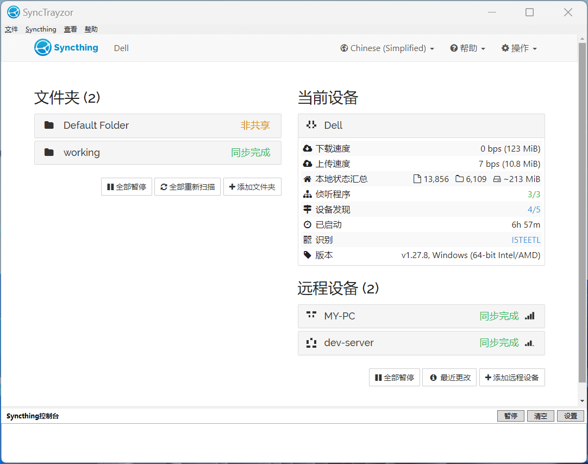
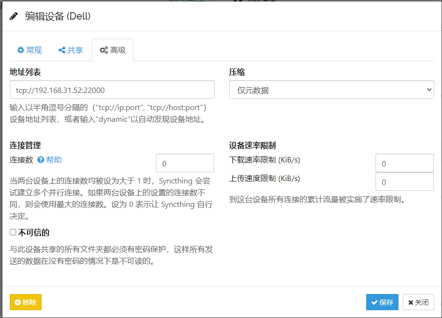

Syncthing 是一款支持 indows、MacOS、Linux、安卓等跨平台同步文件程序，在Syncthing官网，提供了各个平台的程序安装包。

支持忽略文件，局域网同步可以直接设置内网地址同步

[https://syncthing.net/downloads/](https://syncthing.net/downloads/)

## Windows 环境

Windows 上可以使用 SyncTrayzor 图形界面操作

[https://github.com/canton7/SyncTrayzor/releases](https://github.com/canton7/SyncTrayzor/releases)



设置内网地址同步



## linux 环境

安装

```sh
sudo mkdir -p /etc/apt/keyrings
sudo curl -L -o /etc/apt/keyrings/syncthing-archive-keyring.gpg https://syncthing.net/release-key.gpg

# Add the "stable" channel to your APT sources:
echo "deb [signed-by=/etc/apt/keyrings/syncthing-archive-keyring.gpg] https://apt.syncthing.net/ syncthing stable" | sudo tee /etc/apt/sources.list.d/syncthing.list

# Update and install syncthing:
sudo apt-get update
sudo apt-get install syncthing
```

## 新增运行用户（可选）

> `useradd` 创建 `syncthing` 用户，并生成 `/home/syncthing` 目录，不会设置密码

```sh
useradd -m syncthing
```

### 运行

切换到syncthing用户，运行命令

```sh
su syncthing
syncthing
```

> 此步骤仅为了自动生成配置文件，运行后可关闭

### 更改web页面监听ip

如果web端需要开放给外网或局域网访问，则需要进行此步骤，如果只是本机访问，则不需要。

编辑以下文件（注意用户名，我的用户名为syncthing所以路径是/home/syncthing/）

```sh
vi /home/syncthing/.config/syncthing/config.xml
```

或

```sh
vi /home/syncthing/.local/state/syncthing/config.xml
```

> 配置文件的路径可能不一样

找下如下行

```xml
<gui enabled="true" tls="false" debugging="false" sendBasicAuthPrompt="false">
    <address>127.0.0.1:8384</address>
    <apikey>bwukMv54</apikey>
    <theme>default</theme>
</gui>
```

将 127.0.0.1:8384 更改为 0.0.0.0:8384，允许所有IP访问。

### 运行并配置开机自动启动（可选）

使用syncthing用户运行

```sh
systemctl start syncthing@syncthing.service
```

使用syncthing用户开机自动运行

```sh
systemctl enable syncthing@syncthing.service
```

访问管理页面

浏览器访问 http://ip:8384 即可

## 参考

上面 Linux 安装的内容是抄的:) [Debian/Ubuntu使用apt的方式安装syncthing](https://sqmn666.com/archives/debian-ubuntushi-yong-aptde-fang-shi-an-zhuang-syncthing)
