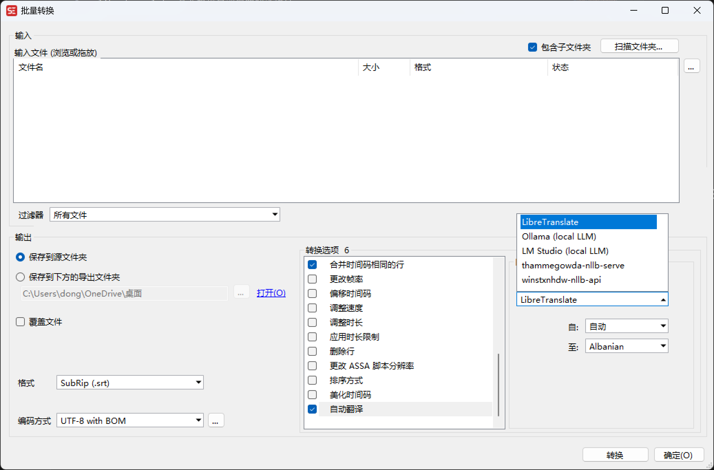
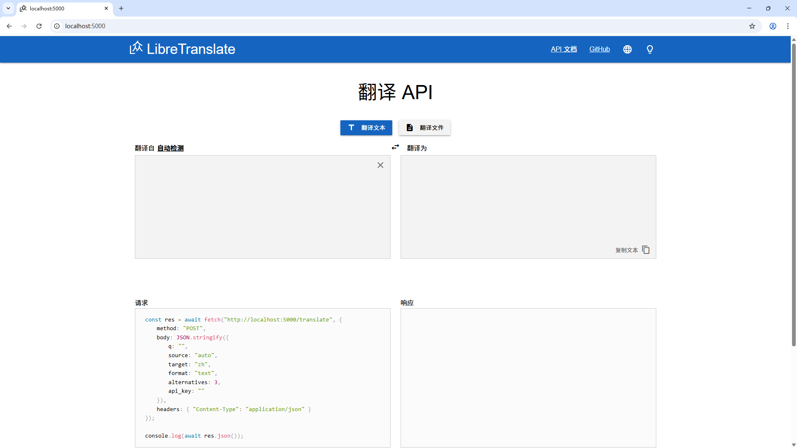

# libretranslate 使用

libretranslate 是个提供自部署的翻译项目

在使用 subtitleedit 用到批量翻译字幕时，用的是本地模型，我选用的是 libretranslate，记录一下部署流程。



可以在 Python 环境下运行或直接 docker 运行

## docker compose 部署

```bash
vim docker-compose.yml
```

```yml
services:
  libretranslate:
    container_name: libretranslate
    image: libretranslate/libretranslate:latest
    ports:
      - '5000:5000'
    restart: unless-stopped
    healthcheck:
      test: ['CMD-SHELL', './venv/bin/python scripts/healthcheck.py']
      interval: 10s
      timeout: 4s
      retries: 4
      start_period: 5s
    ## Uncomment this for logging in docker compose logs
    # tty: true
    ## Uncomment above command and define your args if necessary
    # command: --ssl --ga-id MY-GA-ID --req-limit 100 --char-limit 500
    ## Uncomment this section and the libretranslate_api_keys volume if you want to backup your API keys
    # environment:
    #   - LT_API_KEYS=true
    #   - LT_API_KEYS_DB_PATH=/app/db/api_keys.db # Same result as `db/api_keys.db` or `./db/api_keys.db`
    ## Uncomment these vars and libretranslate_models volume to optimize loading time.
    #   - LT_UPDATE_MODELS=true
    #   - LT_LOAD_ONLY=en,fr
    volumes:
      - libretranslate_api_keys:/app/db
      # Keep the models in a docker volume, to avoid re-downloading on startup
      - libretranslate_models:/home/libretranslate/.local:rw

volumes:
  libretranslate_api_keys:
  libretranslate_models:
```

运行

```bash
docker compose up -d
```

执行后，程序自动下载大约 9GB 语言模型文件后才能成功启动

> 手动下载语言模型

```bash
docker exec {container_id} /app/venv/bin/libretranslate --update-models
```

打开 http://localhost:5000 访问翻译的网页端

预览图



## Python 部署

### 创建新的 wsl 环境

```bash
wsl --import translate C:\wsl\translate C:\wsl-backup\dev.tar.gz
```

### 下载 Miniconda3

```bash
wget -c https://repo.anaconda.com/miniconda/Miniconda3-latest-Linux-x86_64.sh
```
### 安装 miniconda3

```bash
sh Miniconda3-latest-Linux-x86_64.sh
```

安装过程中，全选择 `yes`，

### 创建一个 python3.10 的环境

> 当前 libretranslate 只支持 Python 3.8, 3.9 or 3.10. [查看文档](https://docs.libretranslate.com/guides/installation/)

```bash
conda create --name libretranslate python=3.10
```

### 启用 libretranslate 环境

```sh
conda activate libretranslate
```

### 安装

```bash
pip install libretranslate
```

### 运行

```
libretranslate
```
