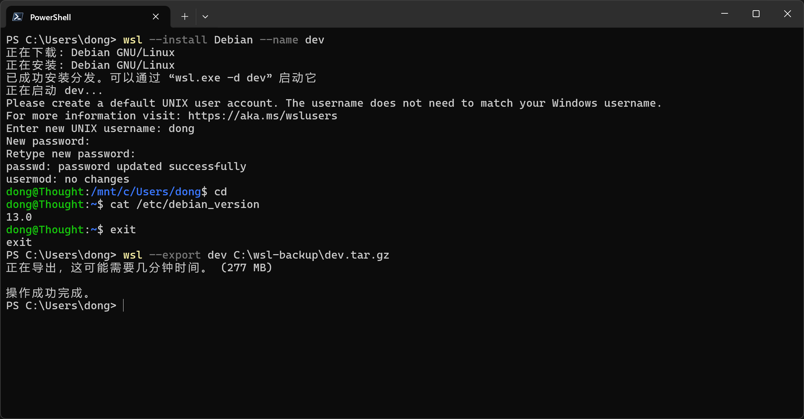

# WSL Debian 使用



## 使用

### 安装

```bash
wsl --install Debian --name dev
```

查看版本信息

```bash
cat /etc/debian_version
```

### 运行

```bash
wsl -d dev
```

### 备份导出

```bash
wsl --export dev C:\wsl-backup\dev.tar.gz
```

### 导入

```bash
wsl --import dev2 C:\wsl\dev2 C:\wsl-backup\dev.tar.gz
```

### 取消注册分发版

> 谨慎操作，取消注册分发版将删除对应文件系统，无法找回

```bash
wsl --unregister dev
```

### 设置默认版本

```
wsl --set-default dev
```

### 修改用户

导入的系统，默认以 root 用户登录，若需指定用户，修改 /etc/wsl.conf 文件，加入下面内容

```ini
[user]
default=<username>
```

## 软件安装

### Nodejs

```bash
curl -o- https://raw.githubusercontent.com/nvm-sh/nvm/v0.40.3/install.sh | bash
```

[获取最新脚本](https://github.com/nvm-sh/nvm?tab=readme-ov-file#install--update-script)

### SourceGit

[WSL 中可以运行 GUI 程序](https://learn.microsoft.com/zh-cn/windows/wsl/tutorials/gui-apps)

```sh
curl https://codeberg.org/api/packages/yataro/debian/repository.key | sudo tee /etc/apt/keyrings/sourcegit.asc
echo "deb [signed-by=/etc/apt/keyrings/sourcegit.asc, arch=amd64,arm64] https://codeberg.org/api/packages/yataro/debian generic main" | sudo tee /etc/apt/sources.list.d/sourcegit.list
sudo apt update
sudo apt install sourcegit
```

安装完成后，执行 `sourcegit` ，即可使用 SourceGit

[文档链接](https://github.com/sourcegit-scm/sourcegit?tab=readme-ov-file#how-to-use)

## SSH

生成密钥

```bash
ssh-keygen -t ed25519 -C "dong@wsl-debian"
```
