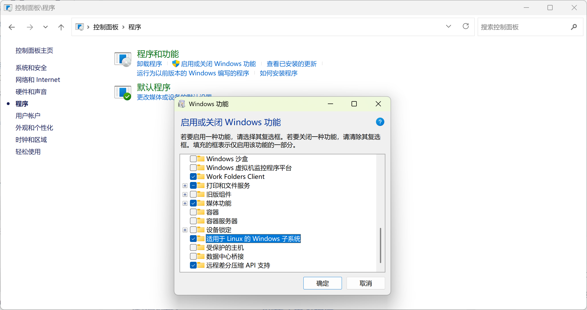

# WSL 安装使用

## 前提条件

开启 Linux 子系统功能

控制面板 -> 程序 -> 启用或关闭 Windows 功能

勾选 “适用于 Linux 的 Windows 子系统”



## 安装

```sh
wsl --install
```

<video controls autoPlay muted src="../../public/static/2025/06/wsl-install.mp4" />

## 导入导出(备份恢复)

备份当前实例

```sh
wsl --export Ubuntu C:\wsl-backup\backup-ubuntu.tar.gz
# Unregister 取消注册分发版并删除根文件系统。
wsl --unregister Ubuntu
```

> `--unregister` 会删除对应文件系统，无法找回

## 装一个全新版本 Ubuntu

```sh
wsl --install -d Ubuntu
```

### 备份新安装的 Ubuntu

```sh
wsl --export Ubuntu C:\wsl-backup\ubuntu-initial-2404.tar.gz
```

### 导入已备份的新 Ubuntu 系统

使用不同的名称和路径，将备份导入多次，可以实现多个实例共存

```sh
wsl --import <Distro> <InstallLocation> <FileName> [options]
```

```sh
wsl --import default-ubuntu C:\wsl\default-ubuntu C:\wsl-backup\ubuntu-initial-2404.tar.gz
wsl --import qwas C:\wsl\qwas C:\wsl-backup\ubuntu-initial-2404.tar.gz
```

### 导入现有备份

```sh
wsl --import default-ubuntu C:\wsl\default-ubuntu C:\wsl-backup\default-ubuntu.tar.gz
wsl --import qwas C:\wsl\qwas C:\wsl-backup\qwas.tar.gz
```

### 备份现有系统

```sh
wsl --export default-ubuntu C:\wsl-backup\default-ubuntu.tar.gz
wsl --export qwas C:\wsl-backup\qwas.tar.gz
```

## 运行指定版本

```sh
wsl -d default-ubuntu
```

```sh
wsl -d qwas
```

## 其他

### 设置默认版本

```sh
wsl --set-default default-ubuntu
```

```sh
wsl --set-default qwas
```

### 修改用户

手动导入的 Ubuntu，默认以 root 用户登录，如指定用户，需要修改 `/etc/wsl.conf` 文件，加入下面内容

```ini
[user]
default=<username>
```

我的配置

```ini
[user]
default=dong
```

## 我的配置

### 初始化

```sh
wsl --import qwas C:\wsl\qwas C:\wsl-backup\ubuntu-initial-2404.tar.gz
wsl --import gui C:\wsl\gui C:\wsl-backup\ubuntu-initial-2404.tar.gz
wsl --import dev C:\wsl\dev C:\wsl-backup\ubuntu-initial-2404.tar.gz
wsl --import clang C:\wsl\clang C:\wsl-backup\ubuntu-initial-2404.tar.gz
wsl --import gcc C:\wsl\gcc C:\wsl-backup\ubuntu-initial-2404.tar.gz
```

### 导出

```sh
wsl --export qwas C:\wsl-backup\qwas.tar.gz
wsl --export gui C:\wsl-backup\gui.tar.gz
wsl --export dev C:\wsl-backup\dev.tar.gz
wsl --export clang C:\wsl-backup\clang.tar.gz
wsl --export gcc C:\wsl-backup\gcc.tar.gz
```

### 导入

```sh
wsl --import qwas C:\wsl\qwas C:\wsl-backup\qwas.tar.gz
wsl --import gui C:\wsl\gui C:\wsl-backup\gui.tar.gz
wsl --import dev C:\wsl\dev C:\wsl-backup\dev.tar.gz
wsl --import clang C:\wsl\clang C:\wsl-backup\clang.tar.gz
wsl --import gcc C:\wsl\gcc C:\wsl-backup\gcc.tar.gz
```

## 参考

[WSL 挂载多个 Ubuntu 系统\_wsl 多个子系统-CSDN 博客](https://blog.csdn.net/weixin_44286143/article/details/134047182)

[Installing multiple instances of Ubuntu in WSL2 | Mourtada.se](https://www.mourtada.se/installing-multiple-instances-of-ubuntu-in-wsl2/)
