# Git 安装截图

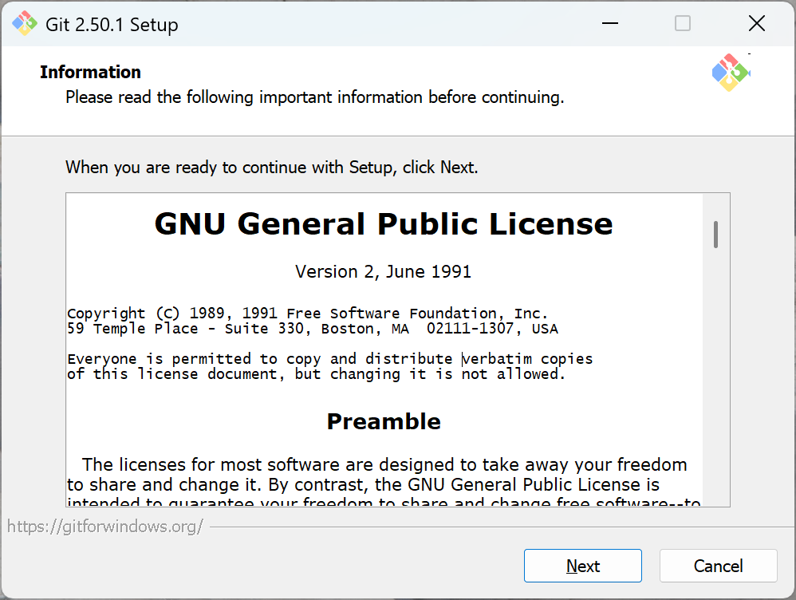

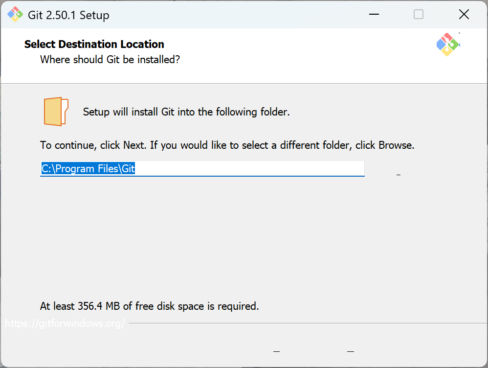

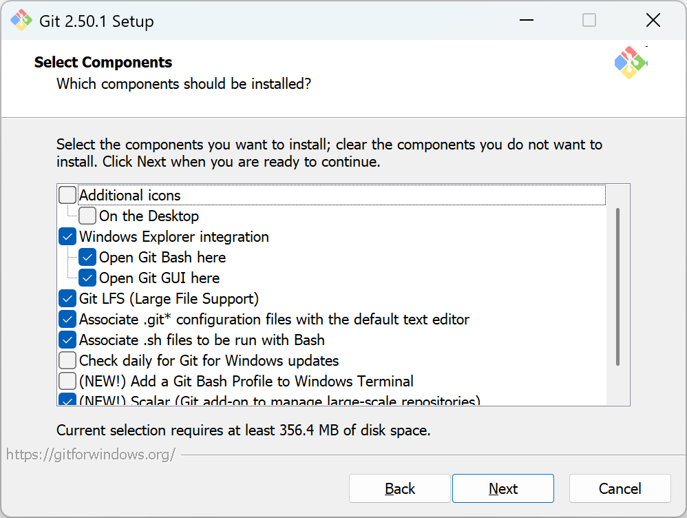

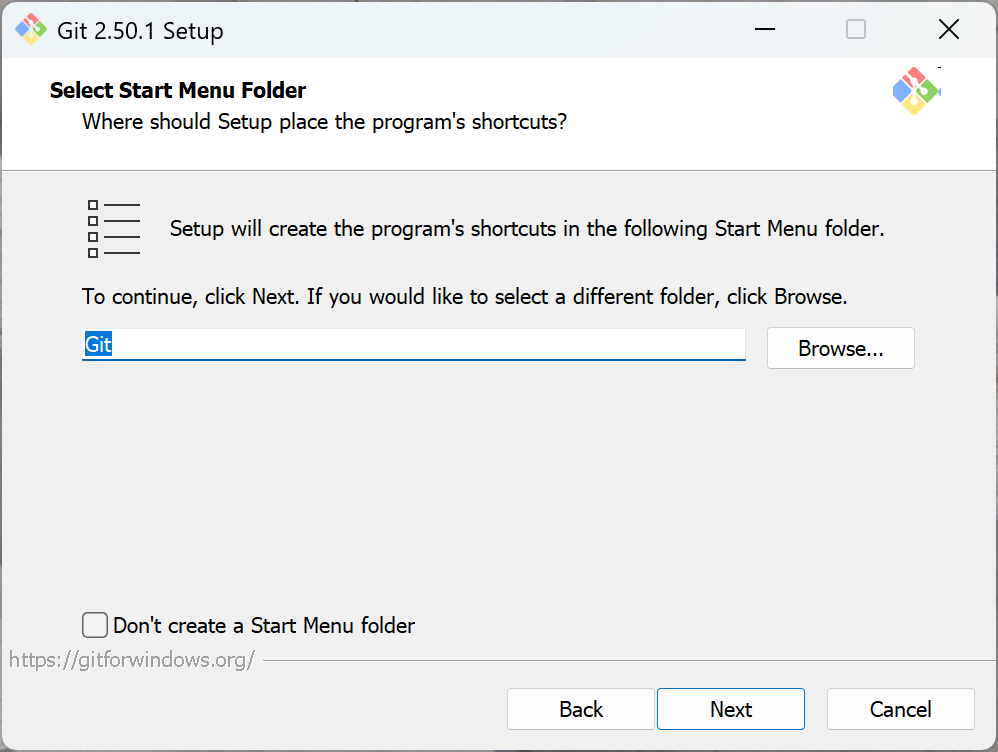

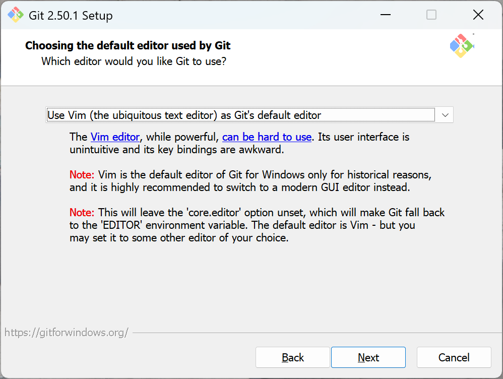

<Image
  originSrc="../../public/static/2025/07/git-06.png"
  src="../../public/static/2025/07/git-06-m.png"
  alt="街头摄影"
  defaultName="原配置"
  enhancedName="修改后的配置"
/>

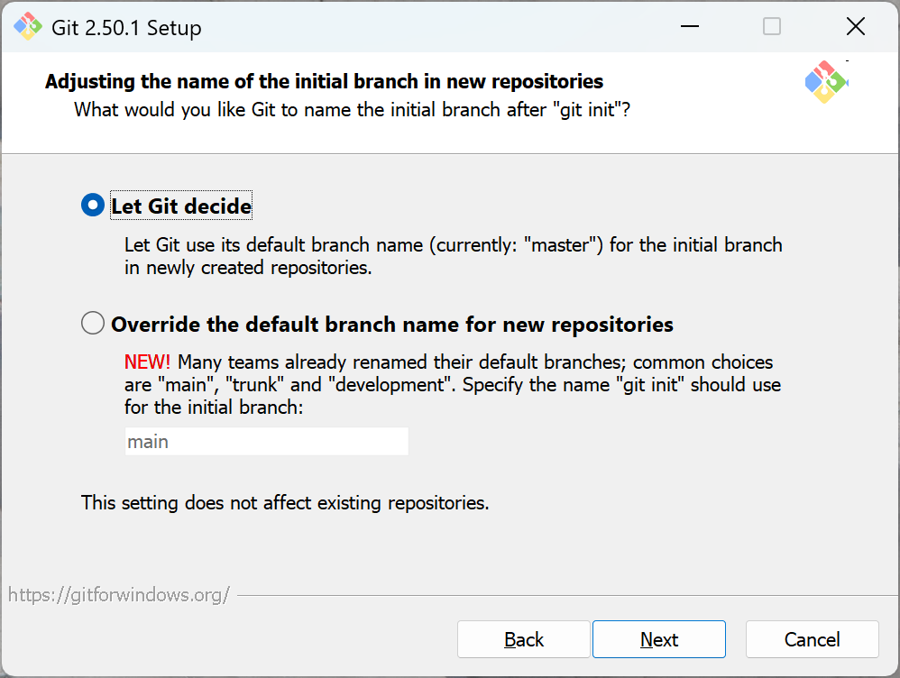

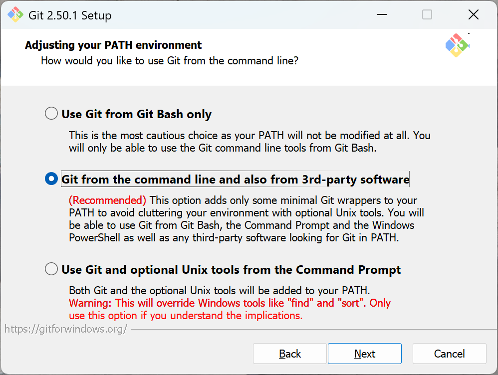

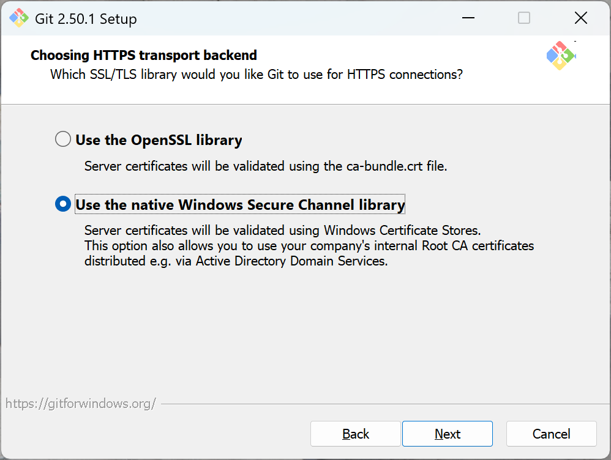

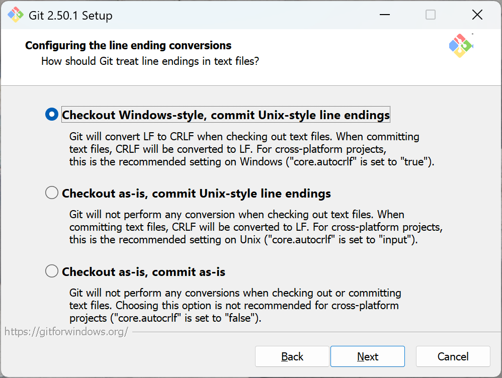

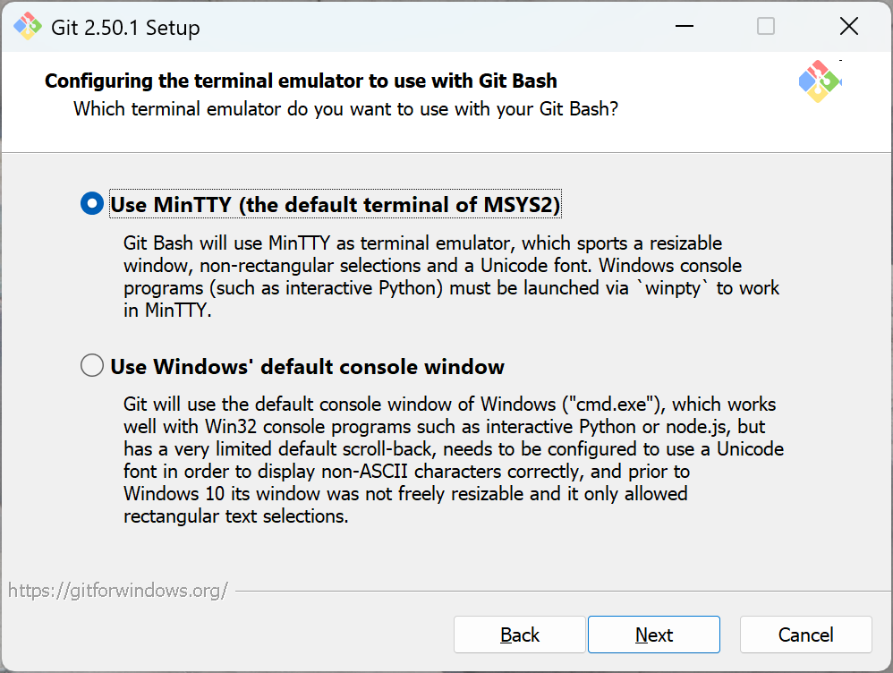

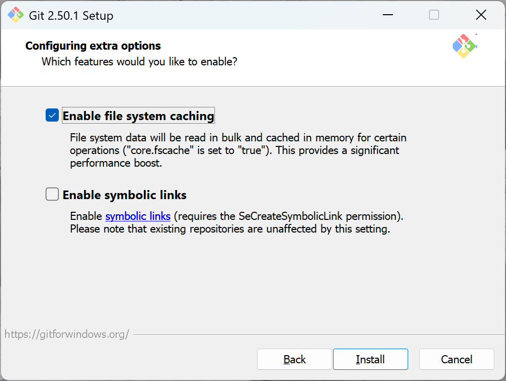

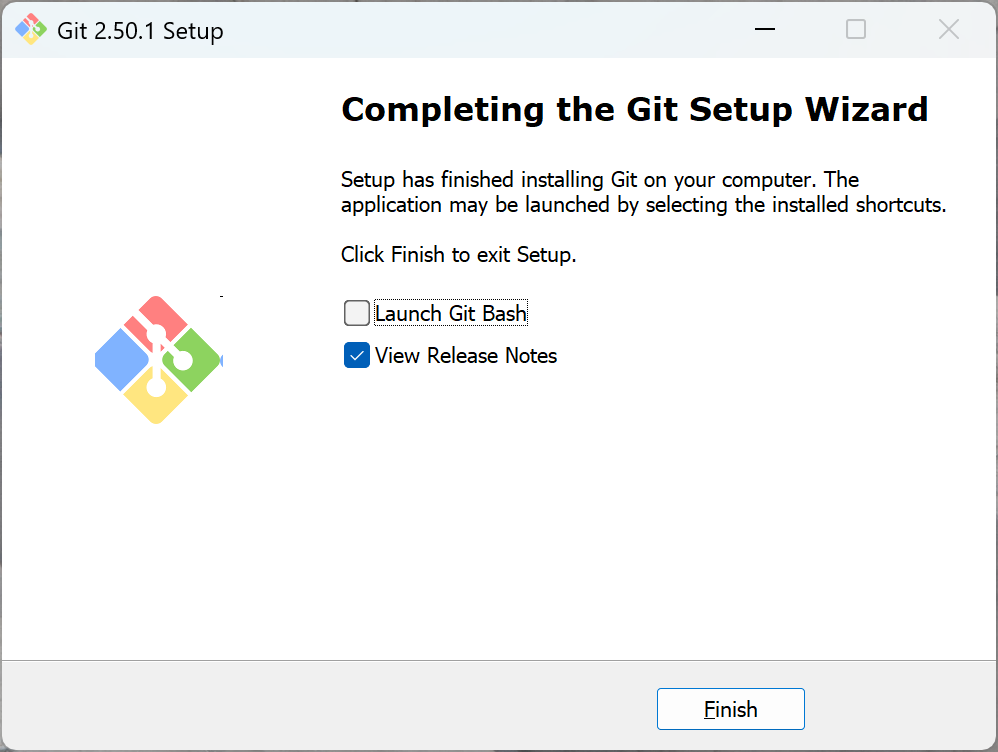
